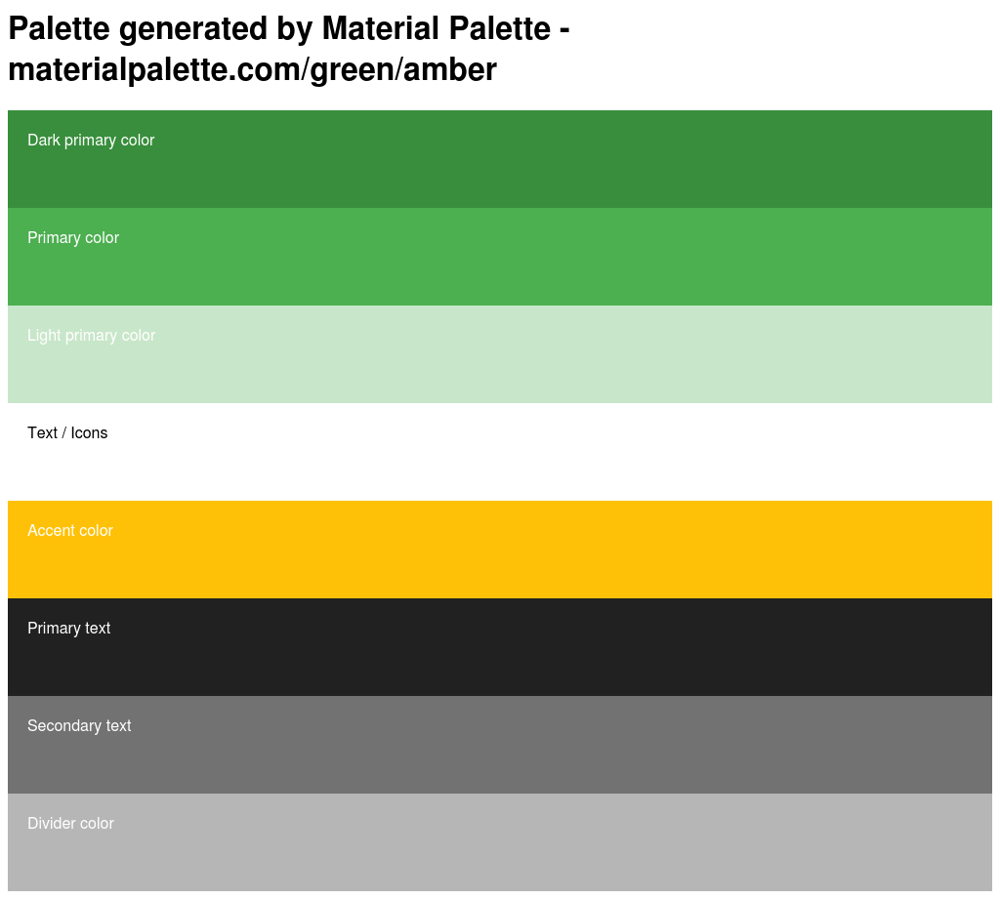

# Documentation for myVerse
## Readme
Readme-Datei des Projects:
[README](readme.html "Link")

## REST
[RAML](api.html "Link")

### Postman
1. Chrome öffnen
2. Postman installieren https://chrome.google.com/webstore/detail/postman/fhbjgbiflinjbdggehcddcbncdddomop
3. Apps -> Postman starten
4. Enviroment importieren: Import > Drop file
5. Sammlung importieren: Import > Drop file
6. Enviroment aktivieren (Rechts oben -> development_server)
[POSTMAN-Sammlung](myVerse.json.postman_collection "Download")
[POSTMAN-Enviroment](development_server.postman_environment.json "Download")

## JSDoc
[JSDoc](jsdoc/index.html "Link")

## Test
[Report](mocha.html "Link")

## Coverage
[Code-Coverage by Istanbul](coverage/lcov-report/index.html "Link")

## Resources
### Logo

### Color Palettte

